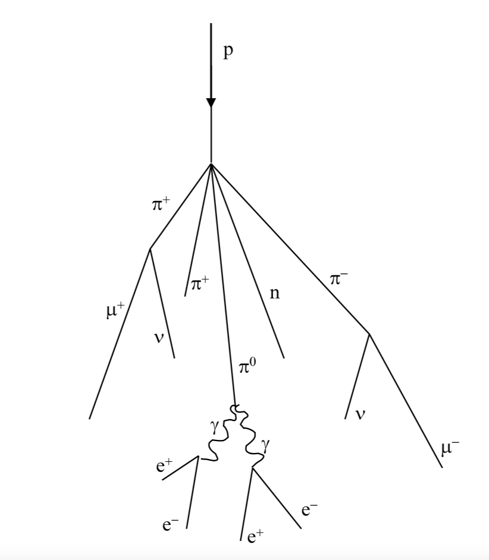

# Introduction
The top of the earth's atmosphere is composed of multiple molecules and high energy particles. From what we understand it is composed of $98$% of the particles (in our atmosphere) are protons or heavier nuclei and $2$% are electrons. Of the protons and nuclei, $87$% are protons, $12$% helium nuclei.." states the author of the Muon Lifetimes Equipment Manual. However, the primary cosmic ray that showers the nuclei, happens to make particles such as protons, neutrons, electrons, photons, etc. After the first process, these particles will then undergo an electromagnetic and nuclear interaction. Some of these particles then interact with the weak force, such particles are known as the muons. Muons are particles that interact with the weak and electromagnetic forces, it is a heavier version than the electron, and hit earth from all different angles at the speed of light. The cosmic ray induced by ray proton hit an air molecule producing pions $\pi$. Pions then decay and turn into muons after a short period of time. 

$\pi^+\rightarrow \mu^+\text{v}_{\mu}$

$\pi^-\rightarrow \mu^-\bar v_{\mu}$

where $\pi^+$ and $\pi^-$ are plus and minus pions. Same with muons, $\mu^+$ and $\mu^-$ are antimuons or muons. Lastly, $v_\mu$ and $\bar{v}_{\mu}$ are muon neutrino and antineutrino.\
Negative muons have a shorter lifetime in the scintillator than positive muons, the reason behind it is negatively charged muons when they enter the scintillator bind with the carbon and hydrogen nuclei. The PEP (Pauli exclusion principle) does not prevent a muon from occupying atomic orbital filled with electrons. Thus, negative muons can interact with protons before they decay. Since a muon has two way of decaying when entering the scintillator, then the negatively charged muons is two time as probable to decay.

$\mu^-+p \rightarrow n+v_{\mu}$

     
    Figure 1: Cosmic ray proton colliding with an air molecule nucleus. $\mu^+$ and $\mu^-$ are the muons, one being positive and one negative.

The decay times for a muon are represented mathematically as:

$N(t) = N_0e^{-\lambda t}=N_0e^{\frac{-t}{\tau}}$

$\tau=\frac{1}{\lambda} \text{ or } \lambda=\frac{1}{\tau}$

Where $N(t)$ is a function of time of a decaying muon, $N_0$ is the number of muons at time $t=0$, $\lambda$ is the decay rate, and $\tau$ is the lifetime of a muon. Where this formula was used from an integration of the change in population of muons resulting in a differential separable integration.\
When doing the experiment of the muon lifetime the average muon lifetime is an average of the antimuons and muons. The lifetime of a negatively charged muon is $\tau_c=2.043\pm 0.003 \mu\text{sec}=\tau^-$. Furthermore, setting $\tau^+$ to be the free space lifetime of the theoretical value $\tau_\mu=2.19703 \pm 0.00004 \mu\text{s}$.

$\tau_{\text{obs}}=(1+p)(\frac{\tau^-\tau^+}{\tau^+ + p\tau^-}))$

This formula allows us to estimate the average muon lifetime we expect to observe. When rearranging for the coefficient $p$, it gives the ratio between muons and antimuons:

$p=-\frac{\tau^+}{\tau^-}(\frac{\tau^--\tau_{\text{obs}}}{\tau^+-\tau_{\text{obs}}})$

Muons interact via weak electromagnetic forces but decay due to weak forces and Fermi coupling constant $G_F$. Fermi coupling constant is a measure of the strength of the weak force:

$\tau = \frac{192\pi^3\hbar^7}{G_F^2m^5c^4}$

Where m is the mass of the muon, other symbols have their own unique meanings. The collective of all constants produce $G_F$.
